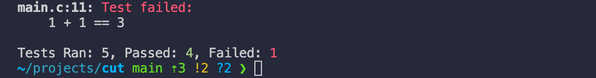

<div align="center">
    
    <p>A minimal C Unit Testing framework</p>
</div>

## Using Cut

Cut is designed to be easily added to your projects. It can be included by adding the `-Icut/inc` to your include path, and the `src/cut.c` file to your compile list. Now, it can be included as `#include <cut/cut.h>`. Here's an example compilation command:

```sh
clang -Icut/inc src/main.c src/cut.c -o example_tests
```

After running several tests, a possible output can look like:



## Documentation

### cutCheck(_test)

`cutCheck(_test)` is a macro function that takes the result of a boolean operation *`_test`* and performs an action according to its value.

- If *`_test`* evaluates to a falsy value (0, NULL, etc.), it generates an error message indicating a test failed.

## Contributing

Contributions are welcomed and encouraged.
